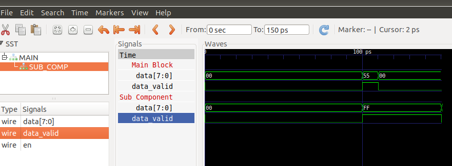

# VCDGEN
A single header c++ library for VCD file generation



### Getting started
```
mkdir build
cd build
cmake ..
make
./tests/vcdgen_tester
gtkwave test_001.vcd
```
Note gtkwave is an Open-Source waveform viewer, which should be downloaded separately.

### Dependencies
* cmake 3.10.0+
* c++ compiler with C++17 support
* gtkwave / a similar GUI program to view waveforms

### Tested on
* g++ 7.5.0
* gtkwave (sudo apt-get install gtkwave)
